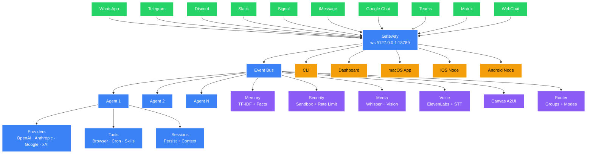
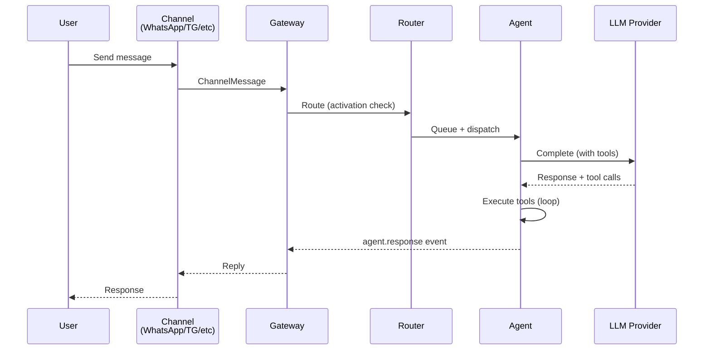

#  Groklets

A framework for building coordinated AI systems across multiple model providers.

Groklets connects Claude, Grok, Gemini, and ChatGPT under one structured coordination layer — where multiple AI agents work together instead of running as isolated prompts. Define agents, assign them to different models, route outputs between them, and run structured workflows. Many models. One system. Structured collaboration.

Instead of `User → One AI → Output`, you build:

```
User → Orchestrator → Multiple AI agents → Coordinated result
```

```bash
npm install -g groklets
groklets onboard
```

---

## 🔥 Highlights

- **Multi-model coordination** — assign agents to OpenAI, Anthropic, Google, or xAI. Mix models in one workflow.
- **Event-driven routing** — pub/sub event bus with wildcards. Agents subscribe to topics and react to each other.
- **Structured agent roles** — define a coordinator, researcher, writer, coder — each with their own model, tools, and purpose.
- **Model failover** — if Claude goes down, route to GPT-4o automatically. Health checks + cooldowns.
- **10 delivery channels** — WhatsApp, Telegram, Discord, Slack, Signal, iMessage, Google Chat, Teams, Matrix, WebChat.
- **Agentic tool loop** — agents call tools, observe results, and iterate autonomously until done.
- **Memory + context** — TF-IDF search, fact extraction, session persistence. Agents remember across conversations.
- **Canvas (A2UI)** — agents push interactive UI (cards, forms, charts) to connected clients.
- **Voice** — ElevenLabs TTS + Whisper STT. Agents can speak and listen.
- **Browser control** — CDP-based Chrome automation. Agents can navigate, screenshot, click, type.
- **Companion apps** — macOS menu bar, iOS, Android. All connect to the same orchestrator.

---

## 🏗 Architecture



### 📱 Message Flow



---

## ⚡ Models (selection + auth)

Any OpenAI-compatible, Anthropic, Google, or xAI model works. Configure in YAML:

```yaml
providers:
  openai:
    type: openai
    api_key: ${OPENAI_API_KEY}
    model: gpt-4o
  anthropic:
    type: anthropic
    api_key: ${ANTHROPIC_API_KEY}
    model: claude-sonnet-4-20250514
  google:
    type: google
    api_key: ${GOOGLE_API_KEY}
    model: gemini-2.0-flash
  xai:
    type: xai
    api_key: ${XAI_API_KEY}
    model: grok-2-latest
```

Model failover: if a provider goes down, Groklets automatically routes to the next healthy provider with cooldown tracking.

---

## 🚀 Quick Start

Runtime: Node ≥ 20.

```bash
# Install globally
npm install -g groklets

# Interactive setup wizard (recommended)
groklets onboard

# Start the Gateway
groklets gateway swarm.yaml --port 18789 --verbose

# Or run directly
groklets run swarm.yaml --interactive

# Submit a task from CLI
groklets run swarm.yaml --task "Summarize today's news"
```

### From source (development)

```bash
git clone https://github.com/Arbazxkr/Groklets.git
cd Groklets
npm install
npm run build
npm run dev
```

### Docker

```bash
docker compose up -d
```

---

## 📱 Channels

### WhatsApp
- Uses Baileys (no Meta Business API needed).
- Scan QR code to link: auto-reconnect, typing indicators, message chunking.
- Config: `channels.whatsapp.phoneNumber`

### Telegram
- Set `TELEGRAM_BOT_TOKEN` env var or `channels.telegram.botToken`.
- Supports polling, typing actions, Markdown rendering, group chats.

### Discord
- Set `DISCORD_BOT_TOKEN` env var or `channels.discord.token`.
- @mention gating in servers, DM support, auto-chunking at 2000 chars.

### Slack
- Set `SLACK_BOT_TOKEN` + `SLACK_APP_TOKEN` (Socket Mode).
- @mention gating, DM support, user name resolution, Markdown.

### Signal
- Requires `signal-cli` installed and registered.
- E2E encrypted, group support, JSON RPC mode.

### iMessage (BlueBubbles)
- Requires BlueBubbles server running on a Mac.
- Config: `channels.imessage.serverUrl` + `channels.imessage.password`.

### Google Chat
- Webhook-based. Config: `channels.googlechat.webhookPort`.

### Microsoft Teams
- Bot Framework webhook. Config: `channels.teams.appId` + `channels.teams.appPassword`.

### Matrix
- Client-Server API with sync polling.
- Config: `channels.matrix.homeserverUrl` + `channels.matrix.accessToken`.

### WebChat
- Built-in HTML/CSS/JS chat served from Gateway. No external deps.
- Default port: `3737`.

---

## 🧠 Everything We Built

### Core Platform
- **Gateway WS control plane** — sessions, presence, authentication, config, events.
- **CLI** — `groklets run`, `gateway`, `validate`, `status`, `doctor`, `health`, `init`, `onboard`.
- **Agent runtime** — tool loop with streaming, context management, session persistence.
- **Session model** — per-chat isolation, group routing, activation modes.
- **Media pipeline** — image/audio/video ingest, Whisper transcription, GPT-4o vision.

### Tools + Automation
- **Browser control** — CDP-based Chrome/Chromium, no Puppeteer. Navigate, screenshot, click, type, evaluate.
- **Canvas (A2UI)** — push HTML/components to client surfaces. Pre-built: card, form, chart, table, markdown.
- **Cron + webhooks** — simplified schedule format (`every 5m`, `daily 09:00`), HTTP webhook routes with auth.
- **Skills platform** — installable tool packs via `manifest.json` + `index.js` convention.
- **Memory** — TF-IDF semantic search, automatic fact extraction from conversations, persistent to disk.

### Runtime + Safety
- **Channel routing** — activation modes (always, mention, keyword, dm-only), group isolation, priority queue, dedup.
- **Presence + typing indicators** — per-channel typing actions.
- **Usage tracking** — per-model cost tracking across all providers.
- **Model failover** — health checks, cooldown periods, automatic rerouting.
- **Security** — skill trust (SHA-256), input sanitization, token bucket rate limiter, tool allowlist/blocklist, VM sandbox.

### Apps
- **macOS** — SwiftUI menu bar control plane, Voice Wake, Talk Mode overlay, Gateway WS client, chat window.
- **iOS** — SwiftUI companion. Canvas, Voice Wake (SFSpeechRecognizer), camera, status, settings.
- **Android** — Jetpack Compose companion. Chat, Canvas, Status, Settings. OkHttp WebSocket, Material3.

### Ops + Packaging
- **Dashboard** — dark-mode web UI served from Gateway. Real-time agents, events, usage, sessions.
- **Docker** — multi-stage Dockerfile (builder + production), docker-compose with all ports + volumes.
- **WebChat** — self-contained HTML/CSS/JS chat interface served from Gateway.

---

## 🔒 Security Model

Groklets connects to real messaging surfaces. Treat inbound messages as untrusted input.

- **Input sanitization** — blocks script injection, shell injection, SQL injection, path traversal.
- **Rate limiting** — token bucket per sender. Configurable max tokens and refill rate.
- **Skill trust** — SHA-256 hash verification. Skills must be trusted before loading.
- **Tool guard** — allowlist/blocklist mode. Block dangerous tools per-session or per-channel.
- **Sandbox** — VM-based code execution with timeout. No filesystem/network access from sandboxed code.

---

## ⚙️ Configuration

Minimal `swarm.yaml`:

```yaml
swarm:
  name: "my-assistant"

  providers:
    openai:
      type: openai
      api_key: ${OPENAI_API_KEY}
      model: gpt-4o
      temperature: 0.7
      max_tokens: 4096

  agents:
    coordinator:
      provider: openai
      system_prompt: |
        You are the coordinator. Break down incoming tasks,
        delegate as needed, and synthesize results.
      subscriptions:
        - task.created
        - agent.response.*

    researcher:
      provider: openai
      system_prompt: |
        You are a research agent. Analyze information,
        find patterns, and provide insights.
      subscriptions:
        - research.*
        - task.created
```

### 🔧 Environment Variables

| Variable | Description |
|---|---|
| `OPENAI_API_KEY` | OpenAI API key |
| `ANTHROPIC_API_KEY` | Anthropic API key |
| `GOOGLE_API_KEY` | Google Gemini API key |
| `XAI_API_KEY` | xAI Grok API key |
| `ELEVENLABS_API_KEY` | ElevenLabs TTS |
| `TELEGRAM_BOT_TOKEN` | Telegram bot token |
| `DISCORD_BOT_TOKEN` | Discord bot token |
| `SLACK_BOT_TOKEN` | Slack bot token |
| `SLACK_APP_TOKEN` | Slack app token (Socket Mode) |

---

## 📁 Project Structure

```
Groklets/
├── src/
│   ├── core/               # Engine + runtime
│   │   ├── agent.ts            # Agent lifecycle + tool loop
│   │   ├── canvas.ts           # A2UI push system
│   │   ├── context.ts          # Context window management
│   │   ├── engine.ts           # Orchestration engine
│   │   ├── event-bus.ts        # Pub/sub with wildcards
│   │   ├── failover.ts         # Model failover + health
│   │   ├── gateway.ts          # WebSocket control plane
│   │   ├── media.ts            # Image/audio/video pipeline
│   │   ├── memory.ts           # TF-IDF memory + facts
│   │   ├── provider.ts         # LLM provider abstraction
│   │   ├── router.ts           # Advanced message routing
│   │   ├── scheduler.ts        # Task scheduler (deps + priority)
│   │   ├── security.ts         # Trust, sanitize, rate limit
│   │   ├── session.ts          # Session persistence
│   │   ├── tool-executor.ts    # Agentic tool loop
│   │   ├── usage.ts            # Cost tracking
│   │   └── voice.ts            # ElevenLabs TTS + Whisper STT
│   ├── channels/            # 10 messaging platforms
│   │   ├── whatsapp.ts         # Baileys
│   │   ├── telegram.ts         # grammY
│   │   ├── discord.ts          # discord.js
│   │   ├── slack.ts            # Bolt
│   │   ├── signal.ts           # signal-cli
│   │   ├── imessage.ts         # BlueBubbles
│   │   ├── googlechat.ts       # Webhook
│   │   ├── teams.ts            # Bot Framework
│   │   ├── matrix.ts           # Client-Server API
│   │   └── webchat.ts          # Built-in HTML
│   ├── plugins/             # Extensions
│   │   ├── skills.ts           # Skill registry
│   │   ├── browser.ts          # CDP Chrome control
│   │   ├── automation.ts       # Cron + webhooks
│   │   └── dashboard.ts        # Web dashboard
│   ├── providers/           # LLM providers
│   │   ├── openai-provider.ts
│   │   ├── anthropic-provider.ts
│   │   ├── google-provider.ts
│   │   └── xai-provider.ts
│   ├── cli/                 # CLI commands
│   └── utils/               # Config, logger, retry
├── apps/
│   ├── macos/               # SwiftUI menu bar app
│   ├── ios/                 # SwiftUI companion node
│   └── android/             # Jetpack Compose companion
├── tests/                   # Vitest test suite
├── Dockerfile
├── docker-compose.yml
└── Groklets.jpg
```

---

## ⚠️ Important Notes

1. **Local-first** — everything runs on your machine. No cloud dependency (except LLM APIs).
2. **WhatsApp uses Baileys** — QR code login, no Meta Business API fees.
3. **Voice requires API keys** — ElevenLabs for TTS, OpenAI for Whisper STT.
4. **Browser control requires Chrome** — auto-detects Chrome/Chromium path.
5. **Native apps are companions** — they connect to the Gateway over WebSocket, they don't run the engine.
6. **Skills are sandboxed** — SHA-256 verified before loading. Untrusted skills are blocked.

---

## 📜 License

MIT
