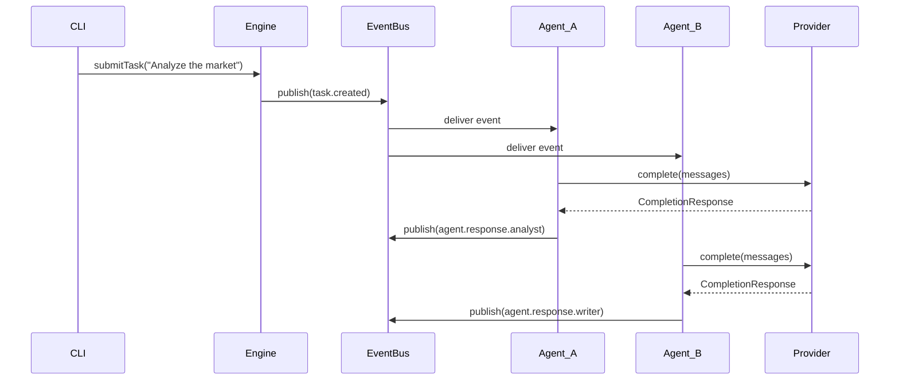
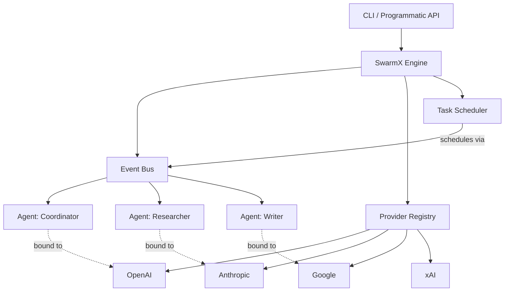

<div align="center">
  
  <h1>⚛ SwarmX</h1>
  <p><strong>A Model-Agnostic, Event-Driven Multi-Agent Orchestration Framework</strong></p>
  <p>Build and coordinate multiple AI agents as one structured system.</p>
</div>

---

## 🌊 Core Overview

SwarmX is a developer-focused framework for orchestrating multiple AI agents that communicate through an event-driven architecture. No vendor lock-in, no cloud dependency — just clean, composable agent systems.

- **Model-agnostic** — OpenAI, Anthropic/Claude, Google/Gemini, xAI/Grok
- **Async & event-driven** — Non-blocking event bus with topic-based pub/sub
- **Local-first** — Runs entirely on your machine
- **CLI-first** — Full-featured CLI for managing swarms
- **Config-driven** — Define your entire swarm in a single YAML file
- **TypeScript-first** — Written in TypeScript with full type safety

---

## ⚙️ 1. How It Works

Agents subscribe to event topics, receive tasks, process them through an LLM provider, and emit results — all through a central event bus. No direct agent-to-agent calls.



---

## 📈 2. Architecture



---

## 🚀 3. Quick Start

### One-line install

```bash
curl -fsSL https://raw.githubusercontent.com/Arbazxkr/SwarmX/main/install.sh | bash
```

### Or install manually

```bash
git clone https://github.com/Arbazxkr/SwarmX.git
cd SwarmX
npm install && npm run build
npm link
```

### Get started

```bash
# Interactive setup wizard
swarmx onboard

# Or create a project manually
swarmx init --name my-swarm --provider openai

# Run your swarm
cd my-swarm && swarmx run swarm.yaml --interactive
```

### CLI Commands

```bash
swarmx run <config.yaml>           # Run a swarm
swarmx run <config.yaml> -i        # Interactive mode
swarmx run <config.yaml> -t "..."  # Run with a task
swarmx validate <config.yaml>      # Validate config
swarmx status <config.yaml>        # Show swarm info
swarmx health <config.yaml>        # Check provider connectivity
swarmx init --name <name>          # Scaffold a new project
swarmx onboard                     # Interactive setup wizard
```

---

## 🔧 4. Configuration

Swarms are defined declaratively in YAML. Agents bind to providers by name. API keys resolve from environment variables.

```yaml
swarm:
  name: "Research Team"

  providers:
    openai:
      type: openai
      api_key: ${OPENAI_API_KEY}
      model: gpt-4o

    anthropic:
      type: anthropic
      api_key: ${ANTHROPIC_API_KEY}
      model: claude-sonnet-4-20250514

  agents:
    coordinator:
      provider: openai
      system_prompt: |
        You are the coordinator. Break down tasks
        and synthesize agent responses.
      subscriptions:
        - task.created
        - agent.response.*

    researcher:
      provider: anthropic
      system_prompt: |
        You are a research agent. Provide in-depth analysis.
      subscriptions:
        - task.created
        - research.*
```

---

## 🛡️ 5. Event System

The event bus supports topic-based routing with wildcards:

| Pattern | Matches |
|---------|---------|
| `task.created` | Exact match only |
| `task.*` | `task.created`, `task.completed`, etc. |
| `agent.response.*` | Any agent response |
| `*` | Everything (global listener) |

Events are processed async with full error isolation — a failing handler never blocks others.

---

## 🏗️ Directory Structure

```
SwarmX/
├── src/
│   ├── index.ts                  # Package root & public API
│   ├── core/
│   │   ├── agent.ts              # Agent base class & lifecycle
│   │   ├── engine.ts             # Core orchestration engine
│   │   ├── event-bus.ts          # Async event bus with pub/sub
│   │   ├── provider.ts           # Provider abstraction layer
│   │   └── scheduler.ts          # Task scheduling & dependencies
│   ├── providers/
│   │   ├── openai-provider.ts    # OpenAI adapter
│   │   ├── anthropic-provider.ts # Anthropic/Claude adapter
│   │   ├── google-provider.ts    # Google/Gemini adapter
│   │   └── xai-provider.ts       # xAI/Grok adapter
│   ├── cli/
│   │   └── main.ts               # CLI (run, init, onboard, health)
│   └── utils/
│       ├── config.ts             # YAML config loader + .env support
│       ├── logger.ts             # Structured logging with levels
│       └── retry.ts              # Exponential backoff for API calls
├── tests/                        # Vitest test suite
├── examples/                     # YAML + TypeScript examples
├── install.sh                    # One-line installer
├── package.json
├── tsconfig.json
└── LICENSE                       # MIT
```

---

## 🔗 Technical Stack

- **Language:** TypeScript 5.6+, Node.js 20+
- **CLI:** Commander, chalk
- **LLM SDKs:** `openai`, `@anthropic-ai/sdk`, `@google/genai`
- **Config:** YAML with env var resolution
- **Testing:** Vitest
- **Validation:** Zod, strict TypeScript

---

## 📊 Supported Providers

| Provider | Package | Default Model |
|----------|---------|---------------|
| **OpenAI** | `openai` | `gpt-4o` |
| **Anthropic** | `@anthropic-ai/sdk` | `claude-sonnet-4-20250514` |
| **Google** | `@google/genai` | `gemini-2.0-flash` |
| **xAI** | `openai` (compatible) | `grok-2-latest` |

---

<div align="center">
  <strong>MIT License</strong> · Built with TypeScript
</div>
